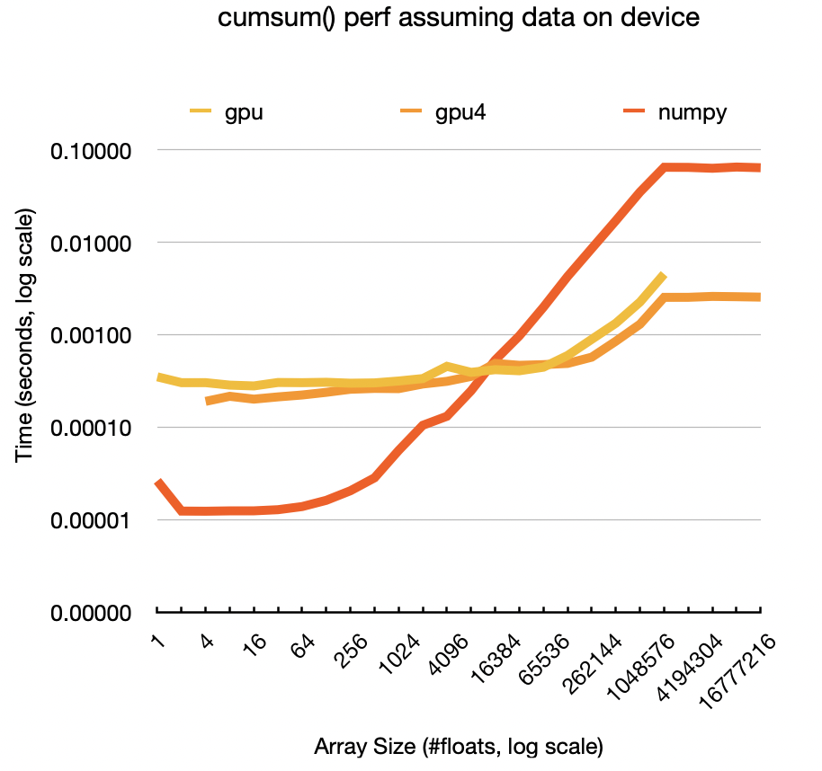

# cuda-prefix-sums

A weekend exercise to teach myself GPU programming.

Inspired by Raph Levien's [blog post](https://raphlinus.github.io/gpu/2020/04/30/prefix-sum.html) on prefix sum, the linked HN [conversation](https://news.ycombinator.com/item?id=22902274) where an experienced GPU programmer calls it "the litmus test of GPU programming", and the linked paper on _decoupled look-back_. Based on the [NVIDIA tutorial](https://www.eecs.umich.edu/courses/eecs570/hw/parprefix.pdf) but intentionally doesn't follow it closely - I wanted to digest each idea, implement it in Python where debugging is fun and easy, then translate my code to CUDA.

Right now there is working code that can process up to 8M floats of data.

I realised that I had a misunderstanding about how grids work, and I can actually write the whole thing as a single kernel that supports much much larger inputs. A prototype written with `numba` already runs in the numba simulator up to 1023 items but fails on 1024, hopefully I'll soon finish debugging it and it will run on huge inputs. I will then simplify the pyCUDA based kernel to use the same algorithm.

## Performance

All performance measurements were made on a free Google Colab instance with a Tesla T4 GPU.

At large sizes (2-8M floats), my code is a ~10% slower than numpy. This is dominated by GPU malloc and memcpy speeds, so not much we can do about it.

However, if we assume the data already exists on the device and the sums mallocs were made in advance, we measure a speedup of more than x30 over numpy.

, and is just a smidgen slower than numpy at the maximum size (ona free Colab instance with a Tesla T4) assuming we need to copy data to and from the device and do allocations, but if we assume data is already on device and needs to stay there and allocations were already done, it's faster for every array size above 2^14 and 14x faster for 2M arrays (this is cheating a bit because the `sums` array allocation is dynamic):

TODO:
- Make it use float4 instead of float
- Measure different kernels on small sizes, and probably move to using different kernels for different levels of the calculation
- Fix it to work on much, much larger buffers
- Profile and make local fixes as needed
- Read the part of the decoupled look-back paper that describes new ideas and not just the current state of the art, get inspired